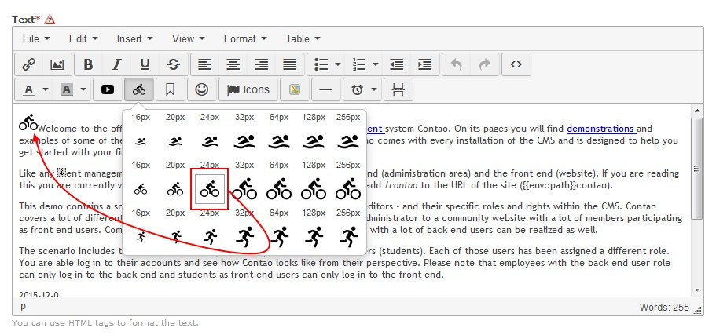

Contao Extension: RscTinyMceTriathlonIcons
==========================================

Special TinyMCE plugin that adds a button for inserting triathlon icons.

Installation
------------

Install the extension via composer: [rsclg/tiny-mce-triathlon-icons](https://packagist.org/packages/rsclg/tiny-mce-triathlon-icons).

If you prefer to install it manually, download the latest release here: https://github.com/rsclg/RscTinyMceTriathlonIcons/releases

Tracker
-------

https://github.com/rsclg/RscTinyMceTriathlonIcons/issues

Compatibility
-------------

- min. Contao version: >= 3.3.0
- max. Contao version: <  3.6.0

Dependency
----------

To load this plugin and add it to the configuration the extension [[TinyMcePluginLoader]](https://github.com/cliffparnitzky/TinyMcePluginLoader) has to be installed.

Screenshot
----------

Additional information
----------------------

### Special notes

There is nothing special to pay attention to.

### Information in the wiki

#### Create a new ...

* [Creating a new plugin](https://github.com/cliffparnitzky/TinyMcePluginLoader/wiki/Creating-a-new-plugin)
* [Creating a new bundle](https://github.com/cliffparnitzky/TinyMcePluginLoader/wiki/Creating-a-new-bundle)
* [Creating a new setup](https://github.com/cliffparnitzky/TinyMcePluginLoader/wiki/Creating-a-new-setup)

#### Installation hints
* [Install manually](https://github.com/cliffparnitzky/TinyMcePluginLoader/wiki/Install-manually)

#### Bug report hints

* [Report a bug](https://github.com/cliffparnitzky/TinyMcePluginLoader/wiki/Report-a-bug)